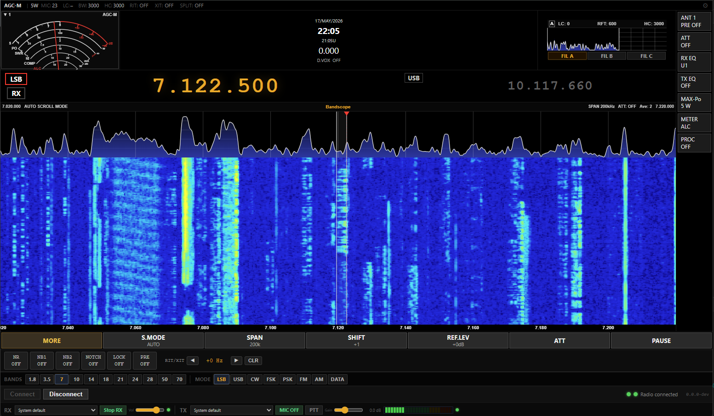
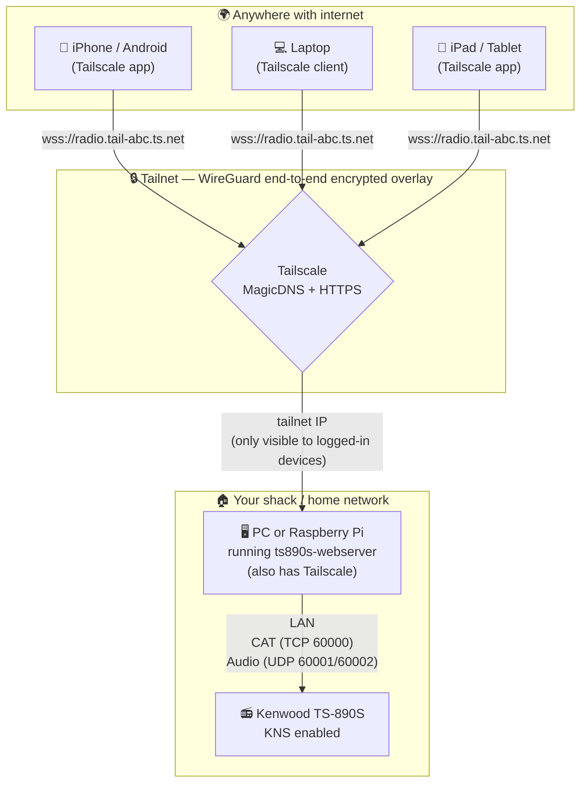
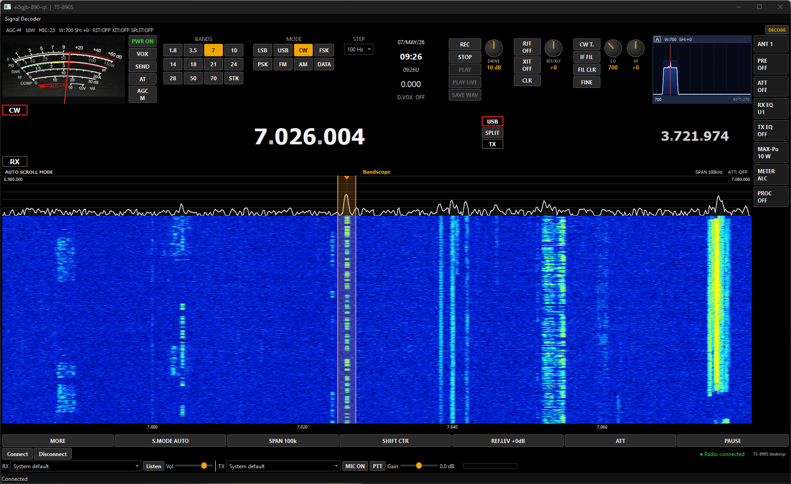
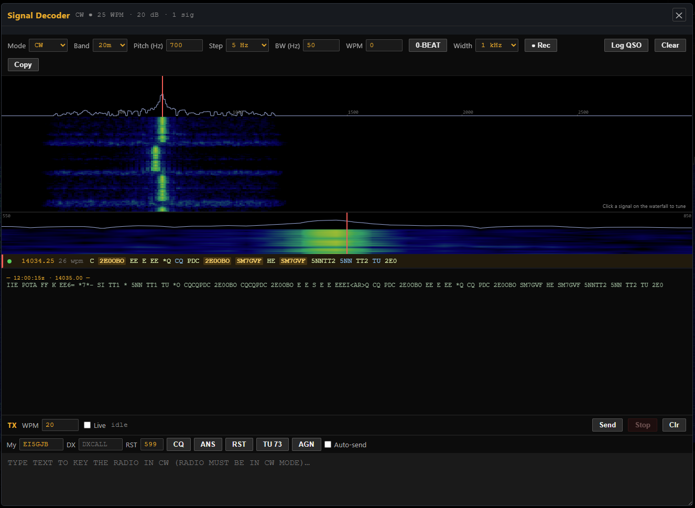
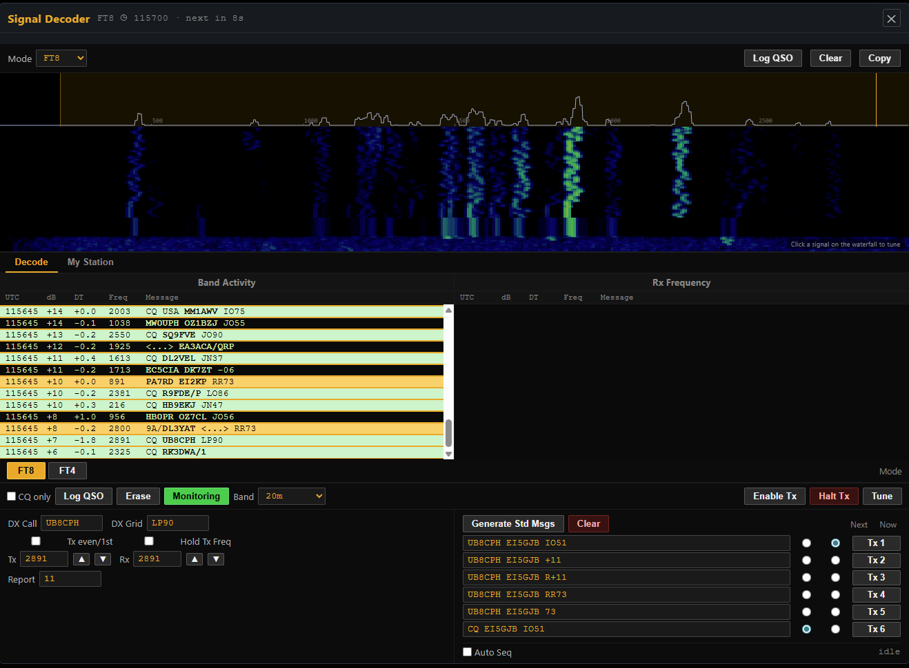
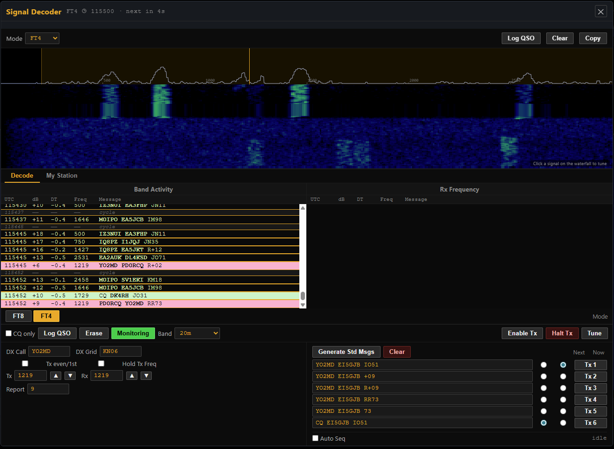
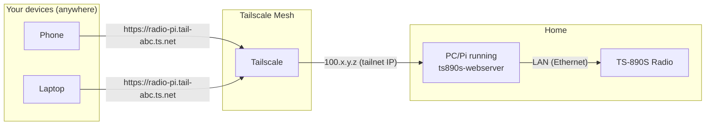
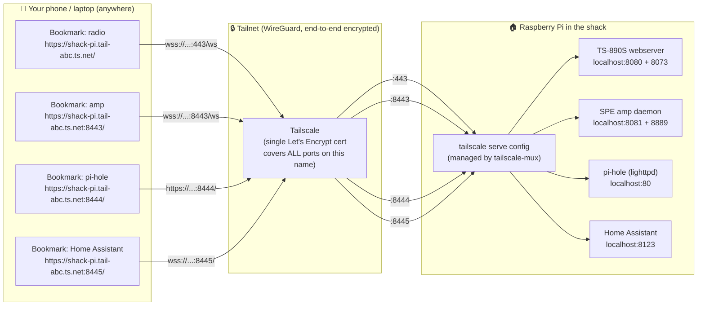

# Kenwood TS-890S Web Console

[](https://github.com/lmacc/Kenwood-TS-890s-Web-Console/releases)
[](https://github.com/lmacc/Kenwood-TS-890s-Web-Console/releases/latest)
[](LICENSE)


A free, open-source browser-based remote control for the **Kenwood TS-890S** HF
transceiver.  Run a small native server next to (or on) the radio; control the
rig from any phone, tablet, or computer with a web browser — over the LAN, or
from anywhere in the world via Tailscale.



---

## ⚠️ Disclaimer — please read before installing

This software is provided **as-is and free of charge, in good faith** under the
GNU General Public License v3.0.  By installing or running it you accept that:

- **The author accepts no liability** for any damage, malfunction, loss of
  data, loss of operating privilege, or any other harm — direct or indirect —
  to your **radio, computer, network equipment, antenna system, or any other
  property** arising from the use, misuse, or inability to use this software.
- **You alone are legally responsible** for any transmissions made via this
  software.  As the licensed operator you must ensure all output is within
  the band, mode, and power limits permitted by your country's amateur radio
  regulations, and that the callsign on the air is yours.
- **No warranty, express or implied**, is offered.  See sections 15–17 of the
  [GPL-3.0 LICENCE](LICENSE) for the full legal text.
- This is a hobby project written by an amateur for amateurs.  It is **not
  certified**, **not endorsed by JVCKenwood**, and is independent of any
  commercial product.

If you are not comfortable with the above, please do not install or run this
software.

---

## Architecture (remote operation via Tailscale)



**Key points:**

1. The webserver runs on a PC or Raspberry Pi physically connected (via
   Ethernet) to the same LAN as the radio.  It talks to the radio over
   Kenwood's standard **KNS (Kenwood Network Command System)** — TCP for CAT
   commands, UDP-RTP for two-way audio.
2. Tailscale provides a private encrypted overlay network: every device you
   install Tailscale on gets a virtual IP, and they can all reach each other
   regardless of where they are or what NAT they're behind.  Nothing is
   exposed to the public internet.
3. Tailscale also provides a real public-CA HTTPS certificate for your
   server's `*.tail-XXXX.ts.net` name — required so phones can use the
   microphone (browsers refuse `getUserMedia` over plain HTTP).
4. Your home router needs **no port forwarding**, no dynamic DNS service, no
   inbound firewall changes.  Tailscale handles NAT traversal entirely.

---

## What it does

- Live **bandscope and waterfall** at ~30 fps over LAN, matching the radio's
  own LCD update rate.
- All the main soft keys you'd expect: S.Mode, Span (5/10/20/30/50/100/200/500
  kHz), Shift, Ref.Level, ATT, Pause.
- Filter widget with **drag-to-adjust passband edges** (SH/SL) live on the
  bandscope.
- VFO A + VFO B with per-digit mouse-wheel tuning, A↔B swap, Split mode with
  quick offset buttons (-50k…+50k), TX-side highlighting on the scope.
- **Full duplex RX/TX audio over the LAN** via the radio's built-in VoIP
  function.  Mic and speakers chosen from any device the browser supports.
- Band buttons that recall the radio's stored mode-per-band (BU command).
- Power on/off toggle (PS command) with network-standby wake-up.
- **Built-in multi-mode signal decoder** — CW, RTTY, PSK31, WEFAX, FT8 and
  FT4 — decoded (and, for CW/RTTY/FT8/FT4, transmitted) right in the browser,
  with no extra software (see [Signal decoder](#signal-decoder) below).
- Mobile-responsive UI with a big floating-action PTT button.
- Server-side persistent radio profile — connect once from any device,
  and from then on every other browser walks in to an already-connected rig.

---

## Native desktop app (Windows)

Alongside the browser UI there's a **native desktop application** (Qt/C++) that
talks to the radio directly over the LAN — the same bandscope, S-meter, filter
widgets and RX/TX audio in a standalone window, no browser required.



It carries a substantially expanded **multi-mode signal decoder** that drives the
radio's own main bandscope (no separate waterfall):

- **CW** — decoder with a timestamped, scrollable copy history.
  Recognised CW acronyms (CQ, DE, RST, 73, QSL…) are highlighted, and every
  decoded callsign is resolved to its **country, CQ zone and ITU zone** from a
  built-in prefix table. Hovering a call can also show the **operator's name**
  via an optional QRZ.com lookup. **Double-click a callsign** to load it as the
  DX call.
- **RTTY / PSK31** — Baudot RTTY (45–100 baud) and BPSK31, with the same
  callsign / country / zone annotation.
- **FT8 / FT4** — a WSJT-X-style Band-Activity / Rx-Frequency log with standard
  message generation, auto-sequencing and transmit; while decoding, the main
  bandscope zooms to 5 kHz and shows green **Rx** / red **Tx** markers.
- **DX panel** — a running list of every callsign heard in any mode with its
  country, CQ / ITU zone and (with QRZ) operator name. A layered filter —
  proper callsign grammar, an *allocated* prefix, and repetition / DE-CQ
  context, plus FT8's CRC — keeps garbled copy from masquerading as real spots.

The window also adds faceplate metering, **band-stacking** presets, a selectable
tuning **STEP**, mode-aware IF-filter (width / shift) controls, AGC and separate
**ANT / PRE / ATT** buttons, and shares the same ADIF + UDP logging and
**My Station** identity used across every mode.

> **Download:** the desktop app ships in every release alongside the webserver —
> **`ts890s-desktop-windows-x64.zip`** (extract, run `890qt.exe`),
> **`ts890s-desktop-linux-x64.AppImage`** (`chmod +x`, then run), and
> **`ts890s-desktop-macos.zip`** (unzip `890qt.app`, right-click → *Open* the
> first time). Grab them from the
> [latest release](https://github.com/lmacc/Kenwood-TS-890s-Web-Console/releases/latest).

---

## Signal decoder

Open the **Decoder** panel and pick a mode from the toolbar.  Everything runs
on the radio's received audio — no virtual audio cables, no WSJT-X install,
nothing to set up.

| Mode | Receive | Transmit |
|---|---|---|
| **CW** | Decoder with rig control | Keyboard / macros (the radio's keyer) |
| **RTTY** | Baudot, 45 / 50 / 75 / 100 baud | AFSK over the radio |
| **PSK31** | BPSK Varicode | — |
| **WEFAX** | Greyscale weather-fax image | — |
| **FT8 / FT4** | Full WSJT-X-style decode | WSJT-X-style transmit |

### CW — decode with rig control

<p align="center"></p>

The CW decoder copies the strongest signal in the passband and turns the panel
into an operating position:

- **Click a signal** on the waterfall — or any decoded callsign — and the
  radio **QSYs** so that signal lands exactly on your pitch (the red line), in
  the radio's own narrow filter.
- **Mouse-wheel fine tuning** over the waterfall with a selectable step
  (1 / 5 / 10 / 25 / 50 / 100 Hz), and a **zero-beat** button that drops the
  nearest carrier precisely onto the pitch.
- A **zoom strip** showing ±150 Hz around the pitch for visual tuning, plus
  **band** and **filter-width** selectors that drive the radio directly.
- **Exchange macros** (CQ / ANS / RST / TU 73 / AGN) and **live keyboard
  keying** straight into the radio's keyer.
- A **timestamped scrollback log**, a one-click **audio recorder** (downloads
  a WAV), and **select-to-grab** — highlight any text to set it as the DX call
  when auto-detection misses one.

### FT8 / FT4

<p align="center">
  
  
</p>

A WSJT-X-style waterfall with Band-Activity and Rx-Frequency logs, standard
message generation, auto-sequencing, and full transmit — all decoded and
encoded server-side, so nothing extra is installed on the operating machine.

### Logging — ADIF + Log4OM

Every mode has a **Log QSO** dialog that records contacts to an ADIF log you
can export from the browser, and can forward each one to a logging program
(Log4OM, N1MM+, DXKeeper, …) over UDP as it is logged.  Set your **callsign,
grid, name and QTH** once under **⚙ Settings → My Station** and every mode —
messages, macros, and the log — uses them automatically.

---

## Quick install per platform

### Windows 10 / 11 (x64)

**Easiest — the one-click installer:**

1. Go to the [latest release](https://github.com/lmacc/Kenwood-TS-890s-Web-Console/releases/latest)
   on this page and download **`ts890s-console-setup.exe`**.
2. Run it.  First time only, Windows SmartScreen shows *"Windows protected
   your PC"* — click *More info* → *Run anyway* (the installer isn't
   code-signed; certificates cost $200-500/year, not realistic for a hobby
   project).  The installer adds Start-menu shortcuts, an optional desktop
   icon, and can add a Windows Firewall rule so other devices on your network
   can reach the page.
3. Launch **TS-890S Web Console** from the Start menu.
   - **The first launch opens a Settings window.**  Set the web-page port
     (leave it at `8080` unless it clashes with something), and — if you like —
     fill in your radio's IP address (shown on the radio's KNS menu screen),
     KNS username, KNS password, and tick *Admin* for transmit control.  A help
     panel in that window lists exactly what to switch on at the radio
     (KNS + built-in VoIP).  Click **OK**.
   - **After that**, launching just shows a small **control window**: the exact
     URLs to open the console (on this PC and from other devices), plus
     **Settings** and **Stop** buttons.  Close the window and it keeps running
     in the system tray — right-click the tray icon for *Open* / *Settings* /
     *Quit*.  It won't ask for settings again unless you press **Settings** or a
     port is already in use.

**Alternative — the portable ZIP (no install):**

1. Download **`ts890s-webserver-windows-x64.zip`** and extract it anywhere
   (right-click → *Extract All…*).
2. Double-click **`890-server.exe`** — it opens the same Settings/control
   window described above.  (`ts890s-launcher.exe` and `start.bat` are also
   included for the older launcher / bare-console workflows.)

Either way:

- On the same PC, open `http://localhost:8080` in any browser if it doesn't
  open automatically.
- From another device on the same LAN, open `http://<your-pc-ip>:8080`
  (find the PC's IP with `ipconfig` in a Command Prompt).

To use the radio from anywhere — phone, work laptop, holiday flat — install
**Tailscale** as well (see the Tailscale section below).

### macOS (Apple Silicon — and Intel via Rosetta)

1. Download **`ts890s-webserver-macos.zip`** from the
   [latest release](https://github.com/lmacc/Kenwood-TS-890s-Web-Console/releases/latest).
2. Extract by double-clicking the ZIP — macOS will produce a folder containing
   `890-server`, `web/`, `start.command`, `ts890s-launcher`, and the bundled
   `Qt frameworks`.
3. **First time only — defeat Gatekeeper:** Right-click on either
   `ts890s-launcher` or `start.command` → choose **Open** from the menu (not
   double-click).  macOS will say *"…cannot be opened because it is from an
   unidentified developer."*  Click **Open** again on the dialog that follows.
   After this one-time approval, macOS remembers it for that file.
4. From then on, double-click `ts890s-launcher` (GUI) or `start.command`
   (Terminal-based) to start the server.
5. Browser opens to `http://localhost:8080` and the on-screen Connect dialog
   takes the radio's IP / KNS credentials.

### Linux (x64 desktop) — AppImage

The Linux build is shipped as a single AppImage that bundles all the Qt
runtime libraries, so it runs on any reasonably modern x64 distro (Ubuntu
22.04+, Fedora 36+, Debian 12+, Mint, Arch, etc.) with no further dependencies.

1. Download **`ts890s-webserver-linux-x64.AppImage`** from the
   [latest release](https://github.com/lmacc/Kenwood-TS-890s-Web-Console/releases/latest).
2. Make it executable:
   ```bash
   chmod +x ts890s-webserver-linux-x64.AppImage
   ```
3. Run it:
   ```bash
   ./ts890s-webserver-linux-x64.AppImage
   ```
   The first run may take a few seconds while AppImage extracts the bundled
   libraries.  A console window keeps the log; closing it stops the server.
4. Open `http://localhost:8080` in a browser; enter radio details via the
   Connect dialog.
5. **Optional GUI launcher:** download **`ts890s-launcher-linux-x64`** from
   the same release, `chmod +x`, and run.  Gives you persistent settings and
   the ngrok button.  Requires the system Tk package
   (`sudo apt install python3-tk` on Debian/Ubuntu).

### Raspberry Pi 4 / 5 (64-bit OS) — recommended one-liner

For the typical "Pi in the shack, always on" setup, a single command does the
whole install: downloads the latest tarball, registers a systemd service so
the server starts on boot, and installs a `ts890s-config` helper for changing
settings later.

```bash
curl -fsSL https://github.com/lmacc/Kenwood-TS-890s-Web-Console/releases/latest/download/install-pi.sh | sudo bash
```

If you'd rather review the script before piping into `sudo bash`:

```bash
curl -fsSL https://github.com/lmacc/Kenwood-TS-890s-Web-Console/releases/latest/download/install-pi.sh -o install-pi.sh
less install-pi.sh
sudo bash install-pi.sh
```

After install:

- The webserver is **running and enabled at boot** as a systemd service.
- Reach it from any browser on the LAN at `http://<pi-ip>:8080`.
- Change ports / view URLs / restart the service / follow the log:
  ```bash
  sudo ts890s-config
  ```
- Check service status:
  ```bash
  sudo systemctl status ts890s-webserver
  ```
- Follow the live log:
  ```bash
  sudo journalctl -u ts890s-webserver -f
  ```
- **Uninstall (one-liner)** — mirrors the install pattern, removes the
  systemd service + binaries + config + the server's saved radio profile:
  ```bash
  curl -fsSL https://github.com/lmacc/Kenwood-TS-890s-Web-Console/releases/latest/download/uninstall-pi.sh | sudo bash
  ```
  Or, if you'd rather use the local copy of the installer without re-downloading
  anything:
  ```bash
  sudo /opt/ts890s-webserver/install-rpi.sh --uninstall
  ```

**32-bit Pi OS / older Pi 3 not supported** — there is no armhf build.  If
you have a Pi 3, install 64-bit Raspberry Pi OS (released 2022+).

#### Manual Pi install (advanced)

If you'd rather not use the one-liner:

1. Download **`ts890s-webserver-raspberry-pi-arm64.tar.gz`** from the
   [latest release](https://github.com/lmacc/Kenwood-TS-890s-Web-Console/releases/latest).
2. Extract:
   ```bash
   mkdir -p ~/ts890s && cd ~/ts890s
   tar xzf ~/Downloads/ts890s-webserver-raspberry-pi-arm64.tar.gz
   ```
3. Install required Qt6 libraries (the Pi build uses the system Qt6):
   ```bash
   sudo apt-get update
   sudo apt-get install -y qt6-base-dev qt6-websockets-dev qt6-multimedia-dev
   ```
4. Run interactively in a terminal:
   ```bash
   ./start.sh
   ```
   Or use the GUI launcher (requires `sudo apt install python3-tk` first):
   ```bash
   ./ts890s-launcher
   ```
5. To install as a systemd service later: `sudo ./install-rpi.sh`.

---

## First-time radio setup (all platforms)

Before any of the above will reach your radio, the radio itself needs three
things configured.  This is a one-time setup on the rig.

### 1. Enable the built-in KNS server

On the radio's front panel:

1. Press **MENU**
2. Scroll to the **KNS** section
3. Find **"Built-in KNS Server"** — set to **ON**

The radio's KNS screen will now display its current LAN IP address.  Note
it down — you'll need it for the browser's Connect dialog.

### 2. Add a KNS user

Still in the KNS menu:

1. Find **"KNS User Registration"**
2. Add a user, e.g.:
   - **User name:** `myuser` (anything you like)
   - **Password:** any password
   - **Permissions:** *Admin* (required for TX control — read-only doesn't
     allow keying)

### 3. Enable network standby (optional but recommended)

Lets the radio respond to remote power-on requests over the LAN.  Otherwise
the radio is fully off when you turn it off via the Web Console — the only
way to power it back on is to walk up to the front panel.

KNS menu → **Network Standby** → **ON**.

### 4. (Optional) DATA-SEND audio source

If you plan to use the **Web Console's mic** for TX (rather than a physical
mic plugged into the front of the radio):

Menu → DATA SEND audio source → **LAN**.

The webserver also sets this automatically (`MS103` CAT command) once
authenticated, so this step is usually unnecessary.

---

## Remote access from anywhere — Tailscale setup in detail

This is the section to follow if you want to operate the radio from work,
from a holiday, from your phone while in the supermarket — basically anywhere
that's not on your home LAN — **without exposing anything to the public
internet** and **without configuring port forwarding** on your router.

### Why Tailscale and not [thing]?

| Approach | Pros | Cons |
|---|---|---|
| **Port forwarding + dynamic DNS** | Old-school, no third party | Exposes your radio to the entire internet.  You'll need DDNS service. Plain HTTP means no microphone access in mobile browsers. |
| **VPN to your home router** | Standard | Requires your router to support OpenVPN/WireGuard server.  Setup is per-router-model. |
| **Cloudflare Tunnel** | Public URL, real HTTPS | Public URL = public attack surface.  Needs Cloudflare Access for auth. |
| **Tailscale (this guide)** | Private, real HTTPS for free, no public surface, no port forwarding | Every device needs the Tailscale app installed once (one-off, ~3 min per device) |

The amateur-radio use case has near-perfect fit with Tailscale: you almost
always operate your own radio from your own devices, so the small friction of
installing a client on each device is a price worth paying for zero public
attack surface and zero router configuration.

### Architecture recap



### Step-by-step

#### A. On the PC or Pi that runs the webserver

This machine (which I'll call the "host") must have Tailscale running so the
tailnet sees it.  Then `tailscale serve` makes the webserver reachable from
other tailnet devices over HTTPS.

**A.1 Install Tailscale on the host**

*On Raspberry Pi / Linux:*

```bash
curl -fsSL https://tailscale.com/install.sh | sh
```

*On Windows:*

Download and run the installer from
[tailscale.com/download/windows](https://tailscale.com/download/windows).

*On macOS:*

Either install from the Mac App Store, or `brew install --cask tailscale`.

**A.2 Sign in**

*Linux / Pi:*

```bash
sudo tailscale up
```

The terminal prints a URL.  Open it in a browser (any browser, anywhere) and
sign in with whatever account you want — Google, Microsoft, GitHub, Apple,
custom email.  This becomes the account that owns your *tailnet*.

*Windows / macOS:*

The installer launches Tailscale automatically.  Click the system-tray icon
and sign in.

**A.3 Confirm the host has joined**

```bash
tailscale status
```

You'll see something like:

```
100.91.42.17    radio-pi          you@example.com  linux   -
```

That `100.x.y.z` address is your host's **tailnet IP**.  The hostname
(`radio-pi` in the example) gives you a friendlier DNS name via Tailscale's
MagicDNS feature: `radio-pi.tail-abc123.ts.net`.

To find the full MagicDNS name:

```bash
tailscale status --json | grep DNSName
```

**A.4 Provision an HTTPS certificate and start serving**

This is the magic step.  Tailscale will request a real, browser-trusted HTTPS
certificate for your `*.tail-XXXX.ts.net` name from Let's Encrypt, and proxy
incoming HTTPS traffic to the local HTTP webserver.

**On a Raspberry Pi installed via the one-liner, you can do this from the
helper instead** — `sudo ts890s-config` → option **8** (*"Set up Tailscale
HTTPS proxy"*).  The helper reads your configured ports, runs both `tailscale
serve` commands, and prints the URL to bookmark.

Doing it by hand (any platform — Tailscale 1.50+ syntax):

```bash
sudo tailscale serve --bg --https=443 --set-path=/   http://localhost:8080
sudo tailscale serve --bg --https=443 --set-path=/ws http://localhost:8073
```

The first command reverse-proxies the web UI; the second covers the WebSocket
endpoint that carries live state and audio.

(Older Tailscale versions used a positional path form
`tailscale serve --bg --https=443 / http://localhost:8080`.  The helper
falls back to that form automatically if the modern `--set-path` syntax
isn't recognised by your Tailscale binary.)

The first time you run these, Tailscale will spend 30–60 seconds requesting
the certificate.  Subsequent runs are instant.

> ⚠️ **Common gotcha:** simply being on the tailnet isn't enough.  If you
> visit `http://<pi-tailnet-ip>:8080` or `http://<pi-name>.tail-XXX.ts.net:8080`
> the browser will mark the page as **Not Secure** because it's plain HTTP —
> microphone access stays disabled.  You must hit the **`https://`** URL on
> port 443 (no port in URL), which requires `tailscale serve --https` to be
> running.  The `ts890s-config` option above takes care of this in one step.

**A.5 Confirm the serve config**

```bash
tailscale serve status
```

You should see your `https://` URL with the two path mappings.

#### B. On every device you want to operate from

**B.1 Install the Tailscale app**

- **iPhone / iPad:** App Store — search "Tailscale"
- **Android:** Play Store — search "Tailscale"
- **Windows / macOS / Linux:** as above

**B.2 Sign in with the same account** you used in step A.2.

**B.3 Confirm the device is on the tailnet**

The Tailscale app/tray icon shows a list of your devices.  Your host
(`radio-pi`) should be visible.

**B.4 Open the URL**

In any browser:

```
https://radio-pi.tail-abc123.ts.net/
```

That's it.  The TLS cert is genuine, so microphone permissions work on
phones.  Anyone not on your tailnet cannot reach this URL — it doesn't
resolve outside the tailnet.

### Tailscale notes

- **Tailnet is free for personal use:** 3 users, 100 devices.  Plenty for a
  single-operator home shack.
- **No router config:** Tailscale uses NAT traversal and (if needed)
  relay servers to make connections work behind even strict NAT or CGNAT.
- **You can revoke a device** any time via the Tailscale admin console at
  [login.tailscale.com](https://login.tailscale.com).  If your phone is
  stolen, kick it off the tailnet — done.
- **What about Tailscale's servers?** Tailscale only sees control-plane
  metadata (which device is asking which device for a connection).  Actual
  data is WireGuard-encrypted end-to-end and goes peer-to-peer; Tailscale's
  servers never see your audio or commands.
- **Tailscale Serve is the magic.**  Without it you can still reach the
  webserver as `http://100.91.42.17:8080`, but you won't have HTTPS, so
  the microphone won't work in mobile browsers.

---

## Multiple services on one Pi — the `tailscale-mux` helper

A typical "shack Pi" doesn't stay a one-job machine for long.  Once the
TS-890S webserver is up, you'll often want the same Pi to host:

- **The TS-890S webserver** (this project)
- **An amplifier remote** like the [SPE 1K-FA / 1.3K-FA web console](https://github.com/lmacc/SPE-Expert-Amplifier-Remote-Webserver)
- **pi-hole** (DNS-level ad blocking) — its admin page is web-based
- **Home Assistant** for home automation
- A locally-running **ESPHome** dashboard or **Node-RED** flow
- A **Grafana** dashboard for your station logs

Tailscale gives every device on your tailnet *one* MagicDNS name
(`<your-pi-name>.tail-XXXX.ts.net`).  By default, `tailscale serve` only
proxies one mount at one HTTPS port.  To expose several services
cleanly, each gets **its own HTTPS port** on the same name.

`tailscale-mux` is the helper that manages this for you — installed
alongside the webserver by the Pi one-line installer, and downloadable
standalone for non-radio Pi users.

### Visual overview



The key things to notice in the diagram:

1. **One tailnet name, many ports.**  Every service is reachable through
   the same `<pi>.tail-XXXX.ts.net` hostname — what changes is the port.
2. **One certificate covers them all.**  Tailscale provisions a single
   Let's Encrypt cert for your tailnet name on first use.  Adding the
   2nd, 3rd, 4th service doesn't request a new cert — they all share
   it because they're the same hostname.
3. **No port forwarding on your router.**  Tailscale uses WireGuard for
   transport; nothing inbound on your home router.
4. **No public attack surface.**  Devices that aren't on your tailnet
   simply cannot resolve `*.tail-XXXX.ts.net` at all.

### Running the helper

```bash
sudo tailscale-mux
```

The opening screen shows what's currently configured:

```
╭────────────────────────────────────────────────────────────────╮
│  Tailscale Mux — multi-service HTTPS multiplexer               │
╰────────────────────────────────────────────────────────────────╯

  Tailnet name:  shack-pi.tail-abc123.ts.net
  Logged in as:  you@example.com

  ─ Configured services ─────────────────────────────────────────

    HTTPS :443    TS-890S Webserver
       /        →  http://localhost:8080
       /ws      →  http://localhost:8073

    HTTPS :8443   SPE Expert Amplifier
       /        →  http://localhost:8081
       /ws      →  http://localhost:8889

    HTTPS :8444   pi-hole admin
       /        →  http://localhost:80

  ─ Actions ─────────────────────────────────────────────────────
  1) Add a service
  2) Remove a service
  3) Show bookmark URLs (+ QR codes if qrencode installed)
  4) Reset — wipe ALL Tailscale Serve config on this machine
  q) Quit

Choose:
```

### Adding a service — step-by-step

Take a worked example: you have the TS-890S webserver already running
on `:8080/:8073` and you've just installed the **SPE Expert Amplifier
remote** on the same Pi at the (non-default) ports `8081/8889`.

1. **`sudo tailscale-mux`** opens the menu.
2. Pick **1) Add a service**.
3. Pick **preset 2 — SPE Expert Amplifier**.  The helper fills in
   `HTTP 8081 / WS 8889` for you.
4. It suggests the next free HTTPS port — likely `8443` since `:443` is
   already taken by the radio.  Accept, or type a different port.
5. Confirm `Y` at the summary prompt.
6. The helper runs:
   ```
   tailscale serve --bg --https=8443 --set-path=/   http://localhost:8081
   tailscale serve --bg --https=8443 --set-path=/ws http://localhost:8889
   ```
7. Done.  Bookmark `https://shack-pi.tail-abc123.ts.net:8443/` on your
   phone.

The whole exchange is under 30 seconds — no editing systemd unit
files, no typing the magic-DNS name, no remembering `--set-path`
syntax.

### Built-in presets

When you pick "Add a service", the wizard offers five paths:

| # | Preset | Fills in HTTP | Fills in WS | Notes |
|---|---|---|---|---|
| 1 | **TS-890S Webserver** | 8080 | 8073 | Same as `ts890s-config` option 8 |
| 2 | **SPE Expert Amplifier** | 8081 | 8889 | Requires the SPE daemon to be moved off its default `:8080` (which clashes with TS-890S) by setting `SPE_HTTP_PORT=8081` in its systemd unit |
| 3 | **pi-hole admin** | 80 | (none) | pi-hole doesn't use WebSockets |
| 4 | **Home Assistant** | 8123 | 8123 | HA serves HTTP + WS on the same port |
| 5 | **Custom** | — | — | Type whatever local ports you need, with optional WS |

Each preset just pre-fills the wizard fields — you can still edit them
before confirming, including the Tailscale-side HTTPS port.

### One certificate, many ports

Tailscale's HTTPS-cert provisioning is **per-device-name**, not per-port.
The very first time `tailscale serve --https=<any-port>` runs on your
Pi, Tailscale's coordination server requests a Let's Encrypt cert for
`<your-pi-name>.tail-XXXX.ts.net`.  That takes 30–60 seconds.  After
that:

- Adding a 2nd service on a different port: **instant** (cert reused)
- Renewing the cert (~30 days before expiry): **automatic in the background**
- You re-running `ts890s-config` option 8 or `tailscale-mux` add: **no new cert request**

You'll only ever see the cert-provisioning wait once per Pi setup.

### QR codes for phones (optional)

Option **3) Show bookmark URLs** prints each URL — and if you have
`qrencode` installed, it also renders an ANSI256-colour QR code right
in the terminal that your phone camera can scan:

```bash
sudo apt install qrencode
```

Then `sudo tailscale-mux` → option 3 shows something like:

```
  Bookmark URLs:
    https://shack-pi.tail-abc123.ts.net/
    [ANSI QR code here]

    https://shack-pi.tail-abc123.ts.net:8443/
    [ANSI QR code here]
```

Open your phone camera, point at the QR, get the bookmark instantly.

### Where the helper stores its state

| Path | What's there |
|---|---|
| `/etc/tailscale-mux/services.conf` | Pipe-delimited list of services (port, path, target, friendly name) — used only for the friendly names in the menu display |
| Tailscale's own state | The actual routing config — `tailscale serve` persists this across reboots automatically |

The two are kept in step on every add / remove.  If you ever manually
run `tailscale serve` outside the helper, the helper's listing won't
know the friendly name of that mount but will still display it.

### Standalone install (no TS-890S webserver)

If you just want the helper without installing the radio webserver:

```bash
sudo curl -fsSL https://github.com/lmacc/Kenwood-TS-890s-Web-Console/releases/latest/download/tailscale-mux \
  -o /usr/local/bin/tailscale-mux
sudo chmod +x /usr/local/bin/tailscale-mux
sudo tailscale-mux
```

The script is pure bash + the `tailscale` CLI.  No Python, no other
dependencies.  Works on any Linux that has systemd and Tailscale
installed (so any Pi running modern Raspberry Pi OS).

### Troubleshooting

**"Tailscale isn't installed on this Pi"** — Install Tailscale first
([tailscale.com/download](https://tailscale.com/download)), then
`sudo tailscale up` to sign in.

**"Tailscale is installed but not logged in"** — Run `sudo tailscale up`
and follow the URL it prints.

**Phone says "this connection is not secure"** — You're hitting the
plain `http://` LAN address.  Use the `https://*.tail-XXXX.ts.net`
URL `tailscale-mux` printed for you instead.

**HTTPS port :8443 / :8444 / etc. won't load** — First-time cert
request on a *new* port can take up to a minute.  Wait, then retry.

**"HTTPS port X is already in use by another service"** — Pick a
different one (`tailscale-mux` will suggest the next free).  If you
genuinely want to replace the existing service, remove it first
(menu option 2).

**Helper's list disagrees with `tailscale serve status`** — The list
shows only mounts the helper knows about (friendly names).  Manual
`tailscale serve` calls outside the helper still work but won't get
displayed by name.  Option **4) Reset** wipes everything cleanly so
you can start fresh.

---

## Mobile usage

Once you're connected via the Tailscale HTTPS URL (so the browser allows
microphone access), the UI on a phone gives you:

- The bandscope and waterfall, full screen-width
- Per-digit wheel/swipe tuning on both VFO A and VFO B
- Stacked side panels (S-meter on top of the bandscope, filter widget below)
- Horizontally-scrollable soft-keys
- A **large floating PTT button** in the bottom-right corner — fixed
  position so it's always reachable with your right thumb regardless of
  what you scroll past on screen
- The Connect dialog and the VFO/Split dialog both fit a phone screen
  (single column on the narrowest devices)

If you're on the LAN over plain HTTP, **microphone capture and speaker
selection will not work** — that's a browser security restriction, not a
limitation of this app.  Use Tailscale (or `localhost` from the PC running
the server) for full mic support.

---

## Configuration / running multiple servers

The defaults are HTTP **8080** / WebSocket **8073**.  You can change them
in three places:

- **Pi:** `sudo ts890s-config` → option 1 / 2 → enter new port → confirm restart.
- **Windows launcher GUI:** the "Server Ports" panel.
- **start scripts:** pass positional arguments:
  ```bash
  ./start.sh 8090 8083    # HTTP 8090, WS 8083
  start.bat 8090 8083
  ```

The browser automatically discovers the right WebSocket port from the page
it loaded.  This means you can run **two server instances** on the same PC
(controlling two radios) with different port pairs — each browser tab finds
its own radio.

---

## Troubleshooting

### "Windows protected your PC" warning

Binary is unsigned (paid code-signing certificates aren't economical for a
free hobby project).  Click *More info* → *Run anyway*.  Windows will
remember after the first run.

### macOS "cannot be opened — unidentified developer"

Right-click the binary → *Open* the first time.  Same reason as Windows.

### No audio on phone

Microphone access requires HTTPS or localhost.  Browse via your Tailscale
URL (`https://...tail-XXX.ts.net`), not a raw IP / hostname over HTTP.

### Connect dialog says "Connection refused"

Three things to check on the radio:

1. KNS menu → **Built-in KNS Server: ON**
2. KNS menu → confirm the radio's IP matches what you typed in the dialog
3. The radio is on and not in network-standby-only mode if you've not yet
   sent it a wake-up.  Walk over and press the power button if in doubt.

### Pi service won't start after reboot

```bash
sudo systemctl status ts890s-webserver
sudo journalctl -u ts890s-webserver -n 50
```

Common causes: port already in use, radio config file unreadable, KNS user
deleted/changed on the rig.

### Bandscope is stuttering

Probably a slow network link.  Lower the bandscope scope-speed isn't yet
exposed in the UI — currently we run it at the radio's High cycle setting
(~30 fps) which uses ~310 kbps.  On a weak 4G uplink this can be too much.
[Open an issue](https://github.com/lmacc/Kenwood-TS-890s-Web-Console/issues)
if you'd like a UI control for this.

### Tailscale "no relay" / can't reach the host

```bash
tailscale netcheck     # on the device that can't connect
```

Confirms which relay region Tailscale is using.  If it shows "no relay
servers reachable", your network is blocking UDP 41641 and you may need to
allow it in your firewall.

---

## Licence and disclaimer

Released under the **GNU General Public License v3.0** — see the [LICENSE](LICENSE)
file for the full legal text.

**No warranty.**  This software is supplied "as is", without warranty of any
kind, express or implied.  The author shall not be liable for any claim,
damages, or other liability arising from the use or inability to use the
software — including, but not limited to: damage to your radio, computer,
network equipment, antenna, premises, or the failure to make a contact, log
a QSO, work a DX station, or comply with the terms of your amateur licence.

By using this software you confirm you have read and accept the disclaimer at
the top of this README.

---

## Source code

The full source for the webserver, web UI, launchers, and CI pipeline lives
in a separate private repository.  This repository
(`Kenwood-TS-890s-Web-Console`) hosts only the **release binaries** and this
README, so end-users can find downloads without wading through code.

For feature requests, or bug reports please use the
[issues](https://github.com/lmacc/Kenwood-TS-890s-Web-Console/issues) on this
repository.

---

73 de **EI5GJB**
